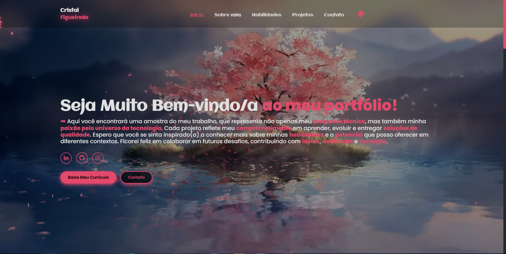

# 💻 Portfólio - Cristal Figueiredo

Bem-vindo(a) ao repositório do meu portfólio! 🌸  
Aqui você encontrará uma amostra do meu trabalho como desenvolvedora, refletindo minha paixão por tecnologia, minha dedicação ao aprendizado contínuo e meu compromisso com a entrega de soluções criativas e de qualidade.

---

## 🚀 Sobre o Projeto

Este portfólio foi desenvolvido com o objetivo de apresentar minhas habilidades técnicas, projetos realizados e um pouco mais sobre mim. Ele serve como uma vitrine profissional, além de ser um espaço de constante evolução à medida que adquiro novos conhecimentos e experiências.

---

## 🔍 Funcionalidades

- Apresentação pessoal e trajetória profissional  
- Lista de habilidades técnicas  
- Projetos desenvolvidos com links e descrições  
- Formulário de contato  
- Download do currículo em PDF  
- Design responsivo e visual agradável

---

## 🛠️ Tecnologias Utilizadas

- HTML5  
- CSS3  
- JavaScript  
- PHP

---

## 📸 Prévia do Projeto

---

## 🔗 Link do Projeto

Acesse o projeto online clicando aqui: [Portfolio - Cristal Figueiredo](https://cristalfigueiredo.netlify.app/)

---

## 📩 Contato

- E-mail: cristalfandrade02@gmail.com
- LinkedIn: ([https://linkedin.com/in/seuperfil](https://www.linkedin.com/in/cristal-figueiredo-9150b9336/)) 
---

> _Este projeto é pessoal e está em constante atualização à medida que evoluo como desenvolvedora._
